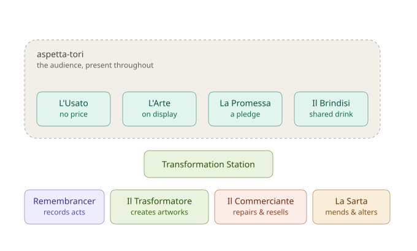

# La Prova — Staging

This is a staging reference: what goes where, and who handles what, when a community 
Node runs the first Slow Theatre performance called La Prova. It is not the script and not the protocol — just the practical layout of the performance and the object flow around it.

## The Node

Everything inside the dashed **aspetta-tori** boundary — the four acts — is
critical to a La Prova's function, and so is the Remembrancer, present throughout and keeping the record from the start. Il Trasformatore and the Transformation Station are different again: integral to every performance, present from the first rehearsal onward, but never load-bearing — a visitor who never notices the Station still gets the whole of Act One, and nothing about La Prova's low threshold depends on it succeeding. La Sarta and Il Commerciante are the genuinely optional layer, added as a performance grows into handling more material; a Node with neither still runs a complete La Prova.

## From unwanted item to its next life

Someone arrives at L'Usato with something they no longer need and gives it
away — no price, no negotiation. From there, an item can go one of three
ways.

**It becomes art.** If the item has creative potential, Il Trasformatore
takes it into the Transformation Station and works it into something new —
cutting, combining, repainting, reassembling. What comes out the other side
moves into L'Arte, where it's displayed and enters the barter economy,
exchanged for other art rather than sold. La Sarta's mending and altering
slots in here specifically for fabric and clothing — a torn garment becomes
wearable art rather than being discarded, feeding the same pathway as Il
Trasformatore's work but through a specialised, textile-only hand.

**It gets repaired and resold.** If the item is functional and simply needs
cleaning, fixing, or a legitimate route to a buyer, Il Commerciante takes it
off-stage entirely. This is the one pathway with genuine legal and fiscal
standing — a real secondhand dealer's trade, conducted outside the
performance, outside La Prova's gift-and-barter logic altogether. Whatever La
Sarta mends that isn't destined for L'Arte can equally end up here — a
repaired coat sold on, rather than displayed.

**It's recycled as waste.** Some of what arrives at L'Usato is genuinely
unusable — nothing to transform, nothing to resell. This third outcome has
no dedicated role, deliberately: it's ordinary disposal, handled the way
anyone handles rubbish, not part of the performance or its economy at all.

## Who's involved, by pathway

- **Il Trasformatore** — the maker, working inside the Station, feeding
  L'Arte
- **La Sarta** — the specialist, working on textiles only, feeding either
  L'Arte or Il Commerciante depending on the piece
- **Il Commerciante** — the trader, working off-stage, feeding the resale
  market
- **The Remembrancer** — outside all three pathways; records that a
  performance happened at all, not what became of any single item

## Objects mark transitions, not costumes or announcements

Nobody wears a costume. No transition in La Prova is spoken or signalled by
an announcement. Where a transition needs to be visible at all, it's marked
by an ordinary object's location changing — never by dress, never by words.
This runs in two directions, worth telling apart:

**A fixed object, moving location, marks who currently holds a role.** The
Remembrancer's cap, the Barista's apron, and the shared tool bag the
Trasformatori carry between the spuntino table and the Transformation
Station all work this way. The object itself doesn't change; where it
currently is — on whose head, at whose station — is what signals who's
currently responsible. Passing the object passes the role, in full view,
with nothing said.

**A fixed location, changing object, marks what something currently is.**
The chain object's permanent plinth works the other way round: the plinth
never moves, and what occupies it does. One form leaves, another arrives,
and the plinth itself is the constant the whole mechanic is read against.

Same principle, read in either direction: it's always a location doing the
signalling, never a costume and never an announcement.

## Three tracks, not three acts

Zoomed out, the whole day is better read as layers running alongside each
other than as one single timeline — closer to separate tracks in a mixing
board than a single script from start to finish.

**Food is the bed track.** It has no start or end cue of its own — it's
simply running underneath everything else, present before the truck
arrives and still present after the performance has faded out.

**Theatre is a clip laid over that bed, with both edges crossfaded rather
than cut.** It fades in on the truck's ambiguous, unannounced arrival, and
fades out the same way — no curtain, no clean declaration that it's
finished.

**Music is the one track that genuinely overlaps the other two, rather
than simply following after them.** It begins nested inside Theatre's own
fade-out (Il Suonatore's warm-up, starting on the bell alongside the
Barista), so for a moment all three layers sound at once — food, theatre's
last breath, music's first notes — before Theatre's track ends and Food
and Music are the only two left playing.

## Il Suonatore

The musician — a satellite role like Il Trasformatore, present or absent
entirely by whoever happens to show up with an instrument. No schedule, no
slot, the lowest-threshold contribution in the whole piece: someone can
simply start playing whenever they feel like it, the same way the truck's
own arrival needs no announcement to be understood.

**Three stages, none of them cueing an act — only riding along on cues
that already exist:**

- **Silent through Acts One to Three.** Present or not, playing or not, no
  effect on anything else in the structure.
- **Warming up from the bell.** The Remembrancer's bell already marks the
  end of Act Three on its own — it doesn't need Il Suonatore's help to do
  that. What starts on the bell is something simple, loose, full of
  pauses, the unmistakable sound of someone tuning or warming up rather
  than performing — running parallel to the Barista filling glasses, both
  quietly using the same already-established timing rather than adding a
  second announcement.
- **Real playing after Il Brindisi.** Act Four already ends open, with no
  fixed exit — the evening simply continues until the last person leaves.
  Full music starting here doesn't create a new act; it's what fills an
  unstructured tail the script already permitted and previously left
  empty. This is the after-party, not a fifth act.

Same caveat as every other satellite addition: worth staying alert to the
same recognition-seeking risk RESERVATO and the chain's benefactor move
both carry. Playing for its own sake is the point; playing to be visibly
appreciated is the thing to stay wary of.

Once Theatre's track has fully ended, the same music means two different
things at once, and nothing in the design picks which: for someone packing
up to leave, it's the sound of the evening winding down; for someone
staying, it's the sound of the evening continuing. Both are correct, at
the same time, for the same notes — nobody is told which one they're
supposed to be having.
