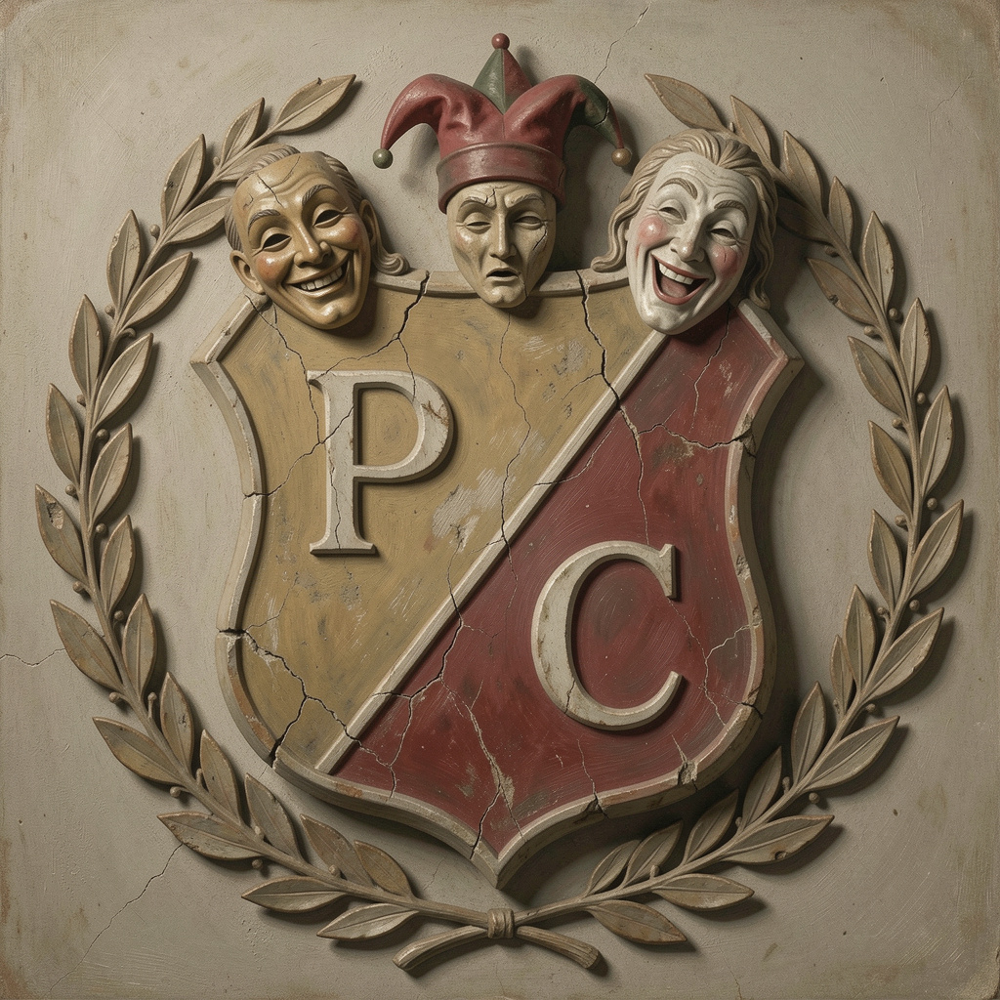

# Panem et Circenses

*Internal working name only. Never the public title — anyone catching
the Juvenal reference reads it as pointed commentary on sight, which
defeats the entire purpose. Public title, below, is deliberately
unremarkable.*

## What this is

A genuine, complete, standalone piece of street theatre — not a decoy,
not built to redirect anyone's attention, existing entirely on its own
legitimate terms. That it also happens to look, to any passerby
including an official one, like exactly what it claims to be —
ordinary outdoor entertainment — is a natural consequence of it
actually being that, not an engineered function. Nothing about it is
false; nothing about it needs to be.

Structurally, it borrows La Prova's own surrounding bustle — the
truck, the mats, the crowd, the ordinary noise of a gathering — as its
set, without needing to build one. This isn't hiding inside La Prova.
It's simply staged nearby, using what's already there the way any
street performer uses whatever square they happen to be in.

## Public title

**"Il Giocoliere"** (The Juggler) — plain, descriptive, exactly what it
sounds like. No further framing offered anywhere, the same
no-explanation-needed register as everything else here.

## The Director — Il Regista

The one deliberate exception in this entire project to "no director."
Worth being clear why it's allowed here specifically: everywhere else,
a director would be shaping how a real person behaves as themselves,
which is exactly the thing Currency and Character argues against. Here,
the performers are playing characters from the outset — the whole
piece is built on that fiction, openly, as ordinary theatre always is.
Directing a character is simply what directing has always meant.
Nothing about La Prova's own rule is being broken; it never applied to
a different kind of production to begin with.

Il Regista coaches the two performers through blocking, timing, and
the turn at the end specifically — the one moment in the piece that
has to land exactly right every time, unlike everything else here
which is allowed to vary.

**Worth naming plainly what this role actually is, since it's the one
genuine exception of its kind anywhere in this project.** Il Regista
holds real, direct authority over other people — not shaping a
fiction from a distance, but genuinely telling two or three
performers what to do, and being followed. Nowhere else here does
that exist: no controlling node in the mesh, no command standing
behind the Remembrancer's role, not even Il Custode's custody rises
to authority over another person. What makes this consistent rather
than a quiet contradiction is three things holding at once: **scope**
(one craft task, the same authority any director or coach legitimately
holds), **consent** (the performers chose to be directed — it's what
being in a show means), and **time** — the authority exists only for
as long as the rehearsal lasts, and ends completely the moment it
does. Bounded on all three, not smuggled in.

**How often the disquieting line actually lands is Il Regista's call,
not fixed here.** Some sessions may be pure technical rehearsal —
blocking, juggling practice, no line delivered at all, which is also,
incidentally, even more convincing cover. Others carry the full turn.
No rule governs the ratio; the person actually present each day is
better positioned to judge than any document could be — the same
discretion already given to the Remembrancer over when Act Three
closes.

## Cast

- **Il Giocoliere** — the juggler, the piece's whole center. Simple
  skill (three or four balls, a couple of basic tricks), warm, plays
  directly to whoever's gathered.
- **L'Assistente** — silent or near-silent, feeds props, occasionally
  the target of a simple joke. Present mostly to give Il Giocoliere
  someone to play against.

No further cast needed. Kept to two on purpose — small enough to
rehearse and run easily, small enough never to become the thing worth
anyone's scrutiny in its own right.

**If Il Giocoliere is ever played by different people across
rehearsals, the waistcoat or hat should be treated the same way as
the Remembrancer's cap or the Trasformatore's tool bag** — a real,
consistent object, worn or carried by whoever currently holds the
role. Same principle already established in 07-staging-la-prova.md,
applied independently here: no shared object with any other layer,
just the same underlying pattern.

## Staging

Minimal, portable: a small clear patch of ground, three or four
juggling balls, one small table, nothing else. No lighting, no
amplification, no set beyond what La Prova's own gathering already
provides around it. The individual piece runs perhaps eight to ten
minutes, start to finish; the rehearsal itself runs roughly as long
as Act One typically does — independently, on its own judgment, not
cued by anything happening elsewhere.

**A small painted canvas backdrop**, referencing traditional indoor
theatre — trompe l'oeil, giving the illusion of depth or architecture
behind the performers. Worked into the painting itself, as if carved into painted stonework:
a heraldic shield, divided diagonally (per bend), with a single "P" in
one half and a single "C" in the other — not "Bread and Circus?",
which is worth ruling out clearly, since a translated, question-marked
phrase would be far more legible as pointed commentary than even the
Latin original. Two separate initials, cleanly divided, carry none of
the risk a run-together abbreviation would — meaningless to anyone who
doesn't already know what they stand for, the same opacity governing
the public title. A heraldic shield is the exact visual language old
guilds and touring companies actually used for their own emblems —
genre-correct, not invented for this purpose. It needs no active
concealment at all. It's simply ordinary theatrical decoration,
because that's genuinely what it is.

*Reference design: per bend, "P" and "C" each in their own half,
clean and unambiguous. Whether the backdrop is painted as a flat
trompe l'oeil illusion or built up in genuine relief to match this
carved, three-dimensional look is still to be decided — the two
approaches need different physical execution.*

**Position: Il Trasformatore and the Transformation Station on one
side of the gathering, the P et C rehearsal on the other.** Two
legible, self-explanatory activities flanking the center, each
readable to a passerby without any context needed. Worth being
honest about one real consideration rather than assuming this is
purely beneficial: two interesting flanking activities can sometimes
frame the quieter middle as much as draw attention away from it — the
way a picture frame pulls the eye toward what's inside it, not just
toward itself. Likely still the right composition, but worth watching
for in practice rather than assumed away.

## The rehearsal, not just the performance

The finished piece exists once, at ZAT scale, on a specific date. The
*rehearsal* can run every ordinary session, from the very first one
onward — and it turns out to do more real work than the eventual
premiere does, precisely because it's continuous rather than
occasional.

Two actors, a director actively coaching blocking and timing, and Il
Suonatore incidentally present nearby: this is instantly, universally
legible as "a rehearsal" to any passerby, no context required. Nobody
needs to redirect a newcomer's attention away from the mats or the
Gallery — those require already knowing what's being looked at to
register as interesting at all. A visibly rehearsing performance
troupe doesn't. A stranger's eye simply lands there first, without
anyone arranging it.

Worth being precise about Il Suonatore's presence here, since it
touches their own established arc rather than adding a new one: this
is the same Il Suonatore, not a second musician, present near the
rehearsal only at points *before* their bell-cued sequence begins.

**Optional extension, when the right musician is available: Il
Suonatore's timeline lengthens backwards, scoring the rehearsal
itself.** Not the ambiguous, unresolved register their own bell-cued
arc depends on — a different register entirely, correct for a
different layer. Modelled directly on the silent-film accompanist:
live, improvised, reactive to the actual physical comedy as it
happens — a stumble catching a small musical flub, a clean catch
earning a flourish — always subordinate to the visual performance,
never itself the focus. Il Regista directs this the same way they
direct the actors' blocking and timing, simply extended to include a
musician: conductor and director are the same job here, not two.

Kept explicitly optional. The baseline rehearsal — two actors, one
director — works completely on its own without a musician present at
all; this is a genuine enrichment when the right person happens to be
part of things, never a dependency the cover relies on.

**Worth naming as its own small instance of accretive theatre, rather
than assuming polish from day one.** The same pattern already governs
the whole project's growth — starting rough, letting real repetition
build it up — applies here too: early sessions can be visibly
unpolished, still finding the blocking, still working out the timing.
That's not a problem to fix quickly. It's the same accretive process
running at a smaller scale, and it happens to make an early rehearsal
an even more convincing, ordinary rehearsal-in-progress.

---

## The piece

*Il Giocoliere enters, ordinary clothes, nothing costume-like beyond
maybe a simple waistcoat or hat — recognisable as "a performer" without
being elaborate. L'Assistente follows with the table and balls.*

**IL GIOCOLIERE:** *(to whoever's gathered, warm, unhurried)*
Buonasera. O buon pomeriggio — non guardo mai l'orologio.

*He begins juggling three balls, simply, competently. Not
spectacular — just pleasant to watch. L'Assistente hands him a fourth
mid-pattern; he catches it without breaking rhythm, a small, earned
laugh.*

**IL GIOCOLIERE:** *(still juggling, easy patter)*
Quattro palle. Facile. Il difficile è farle sembrare felici di stare
in aria.

*He drops one — clearly on purpose, a practiced "mistake," catches it
on his foot, flips it back into the pattern. Another small laugh.
L'Assistente rolls their eyes theatrically. Small, comfortable bit of
business between them — nothing that needs describing further; any
two performers with basic clowning instinct can build this beat
themselves.*

*He finishes the pattern with a flourish, bows slightly, catches his
breath.*

**IL GIOCOLIERE:** *(to the crowd, still smiling, but something in the
pace changes — slower, quieter, not performed the same way the rest
was)*
Sapete la cosa buffa delle palle in aria? Non cadono mai finché
qualcuno guarda.

*A beat. He looks at the balls, now still in his hands, not juggling.*

**IL GIOCOLIERE:** *(plain, almost to himself, no longer playing to
the crowd at all)*
Mi chiedo, a volte, cosa sto tenendo su. E cosa, nel frattempo, sta
cadendo, da qualche altra parte, mentre voi guardate qui.

*He looks up, meets the crowd's eyes for a moment — too long a beat
for comfort. Then, abruptly, the warmth returns, as if nothing
happened.*

**IL GIOCOLIERE:** *(bright again, already moving)*
Ma no — sciocchezze. Applausi per il mio assistente, che oggi non ha
fatto cadere niente.

*He bows. L'Assistente bows. They exit together, ordinary, unhurried,
exactly as they arrived. No further acknowledgment of the previous
beat, from either performer, ever.*

---

## If someone asks directly

The rest of this project handles direct questions by having the true,
ordinary answer already be the undisclosed one — no evasion needed,
nothing to construct. P et C needs its own self-contained version of
this, pointing nowhere near La Prova, never toward the QR code or
anything else this layer doesn't own.

- *"Cos'è questo?"* → *"È solo un piccolo numero di giocoleria, ci
  stiamo esercitando per uno spettacolo."* (It's just a small juggling
  act, we're rehearsing for a show.)
- *"Con chi siete?"* → *"Siamo solo noi due — proviamo qui perché c'è
  spazio."* (Just the two of us — we rehearse here because there's
  room.) True, complete, and requires nothing further.

## The ending's job, and its one hard rule

The unsettling line is the entire mechanism, and it earns its place by
being brief and by never being explained or referenced again — inside
the piece, or after it. Il Regista should hold performers to this
strictly: no lingering on it, no knowing glance to the audience
afterward, nothing that would turn a genuine moment of disquiet into a
wink. It has to land once, plainly, and then the piece has to
visibly, fully move past it. That's what makes it disquieting rather
than merely clever — the show doesn't validate that anything real just
happened. It just continues.

Whether this moment ever becomes a deliberate bridge toward La Prova —
a next step for someone who leaves wondering what they actually just
watched — is still undecided, and doesn't need deciding now. The line
works as written whether or not anything ever follows from it.
